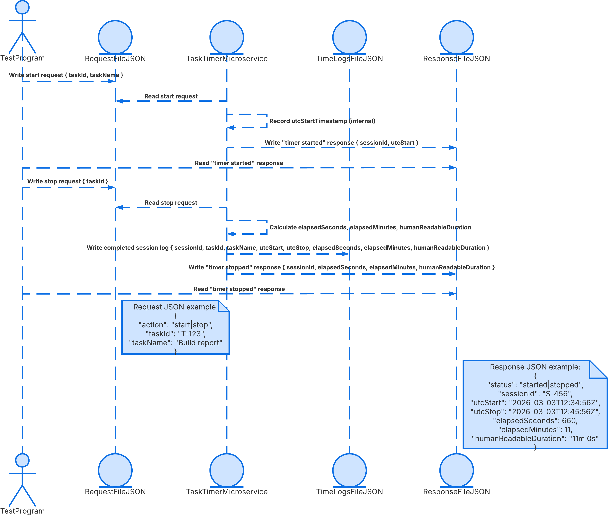
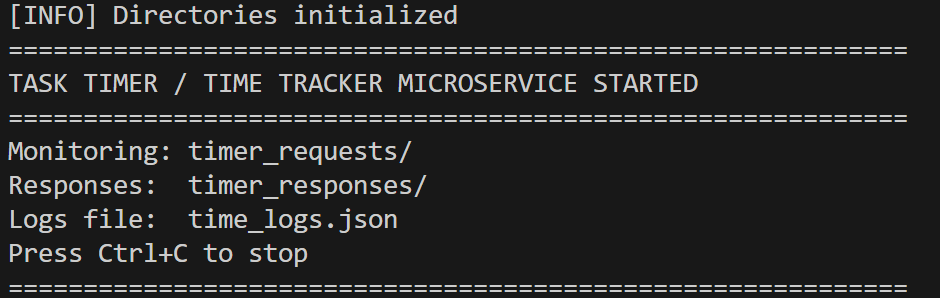

# TaskTracker_Service

## How to REQUEST Data

Communication Pipe
JSON Text Files — Your program writes a .json request file to the timer_requests/ directory. The microservice monitors this directory and automatically detects and processes new files.
Request Parameters
ParameterTypeRequiredDescriptionrequest_idstringYesUnique identifier for the requestactionstringYesOne of: "start", "stop", "logs"task_idstringYes (start/stop)Unique task identifier to timetask_namestringNoHuman-readable task name
Instructions

Create a JSON object with the required parameters.
Save it as a .json file in the timer_requests/ directory.
Use the filename format: timer_request_<request_id>.json
The microservice will automatically detect and process the file.

## Example REQUEST Call (Python)

python import json
import os
from datetime import datetime

## Start a timer

request = {
    "request_id": "start_001",
    "action": "start",
    "task_id": "T001",
    "task_name": "Study for midterm",
    "timestamp": datetime.now().isoformat()
}

os.makedirs("timer_requests", exist_ok=True)
with open("timer_requests/timer_request_start_001.json", "w") as f:
    json.dump(request, f, indent=2)

## Stop a timer

stop_request = {
    "request_id": "stop_001",
    "action": "stop",
    "task_id": "T001",
    "timestamp": datetime.now().isoformat()
}

with open("timer_requests/timer_request_stop_001.json", "w") as f:
    json.dump(stop_request, f, indent=2)

## How to RECEIVE Data

The microservice writes response files to the timer_responses/ directory after processing each request.
Response Filename Format
timer_response_<request_id>.json
Start Response Fields

Monitor the timer_responses/ directory for a response file.
Look for the filename: timer_response_<request_id>.json
Read and parse the JSON file.
Check the status field to determine success or failure.

## Example RECEIVE Call (Python)

python import json
import time
import os

response_file = "timer_responses/timer_response_stop_001.json"
timeout = 10
start = time.time()

while time.time() - start < timeout:
    if os.path.exists(response_file):
        with open(response_file, "r") as f:
            response = json.load(f)
        if response["status"] == "timer_stopped":
            print(f"Time spent: {response['duration_readable']}")
        elif response["status"] == "error":
            print(f"Error: {response['error_message']}")
        break
    time.sleep(0.5)

## Example Stop Response

json{
  "request_id": "stop_001",
  "status": "timer_stopped",
  "task_id": "T001",
  "task_name": "Study for midterm",
  "session_id": "session_T001_20260302143000",
  "start_time": "2026-03-02T14:30:00+00:00",
  "stop_time": "2026-03-02T14:45:30+00:00",
  "elapsed_seconds": 930,
  "elapsed_minutes": 15.5,
  "duration_readable": "15m 30s",
  "timestamp": "2026-03-02T14:45:30+00:00"
}
## Example Error Response

json{
  "request_id": "stop_002",
  "status": "error",
  "error_message": "No active timer found for task_id: T001. Start a timer first.",
  "timestamp": "2026-03-02T14:00:00+00:00"
}

## UML

## Description

The Task Timer / Time Tracker is a file-based microservice that tracks how long a user spends on individual tasks. It was built to answer a question that most task management apps ignore: not just what you need to do, but how long you actually spend doing it.

## Table of Contents (Optional)

- [Description](#description)
- [Installation](#installation)
- [Usage](#usage)
- [Credits](#credits)
- [License](#license)
- [Badges](#badges)
- [Features](#features)
- [Tests](#tests)

## Installation

1. Ensure the latest version of Python is installed - https://www.python.org/downloads/
2. Git clone the repo

## Usage

1. Terminal 1 -> Start the microservice - Python timer_service.py 

2. Terminal 2 -> Run test program - Python test_timer.py

## Credits
Raja Zafar (https://github.com/HassanZafar-2021)

## License

No License

## Badges

https://img.shields.io/badge/Python-3.10+-3776AB?logo=python&logoColor=white

## Features

✅ Start/Stop Timer — Track time for any task by ID
✅ UTC Timestamps — All times stored and compared in UTC for accuracy
✅ Human-Readable Durations — Returns formats like "2h 15m 30s"
✅ Persistent Logs — All sessions saved to time_logs.json across restarts
✅ Summary Analytics — Logs endpoint returns total time per task across all sessions
✅ Duplicate Timer Prevention — Returns error if timer already running for a task
✅ Zero Dependencies — Uses only the Python standard library

## How to Contribute

Fork the Repo

1. Create a feature branch
2. Commit your changes
3. Push to the branch
4. Open a Pull Request

## Tests

python test_timer.py